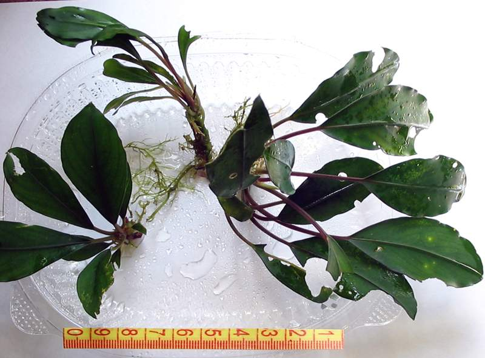
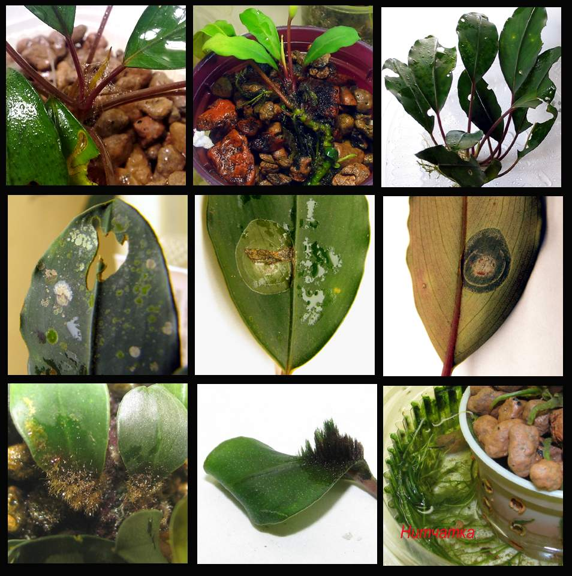
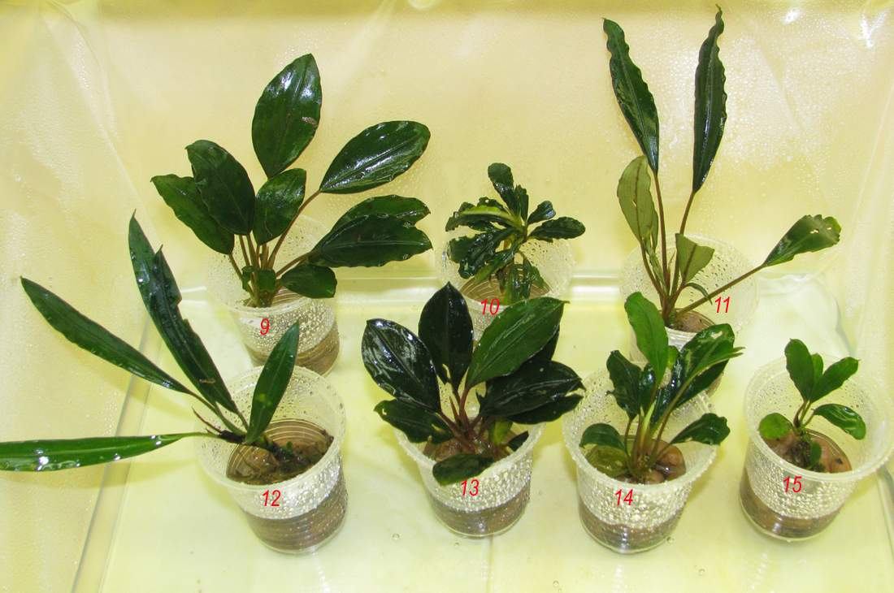
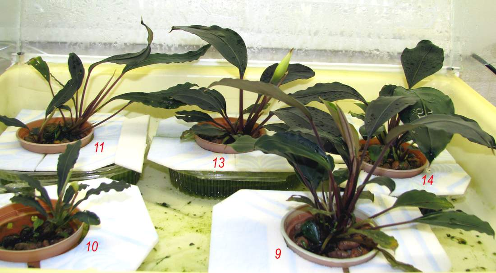
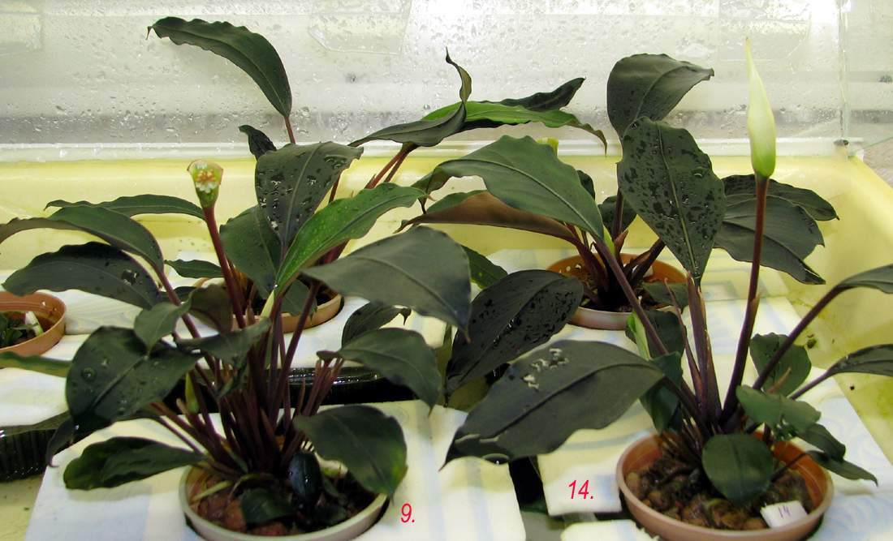
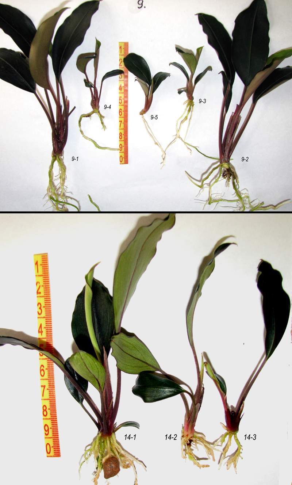
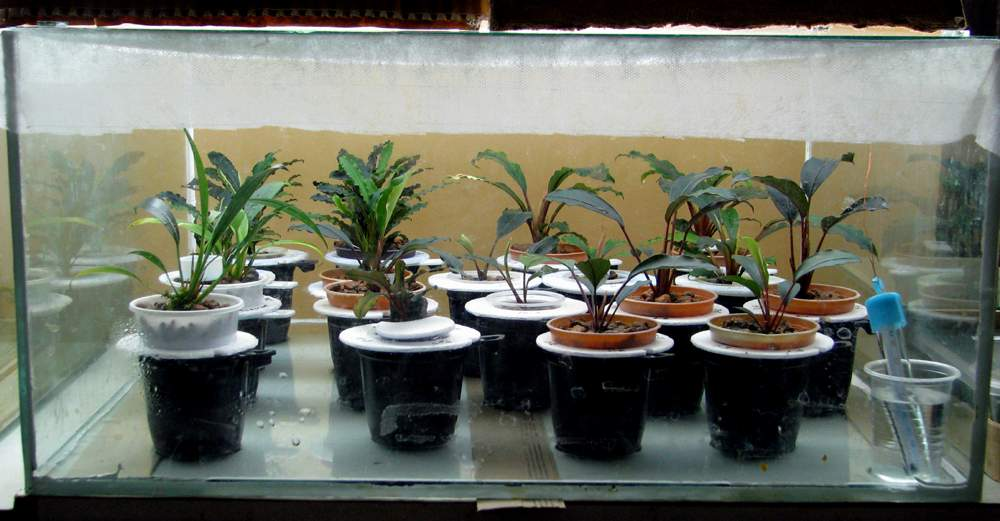
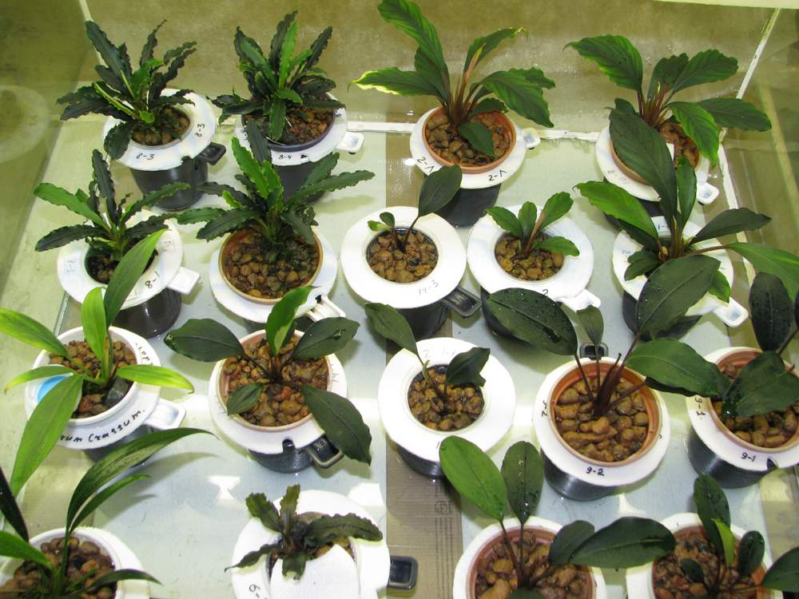
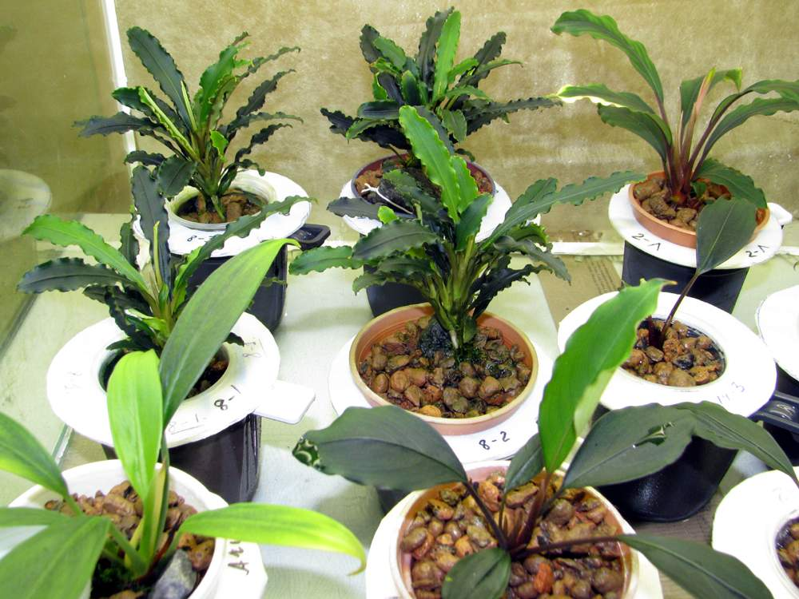
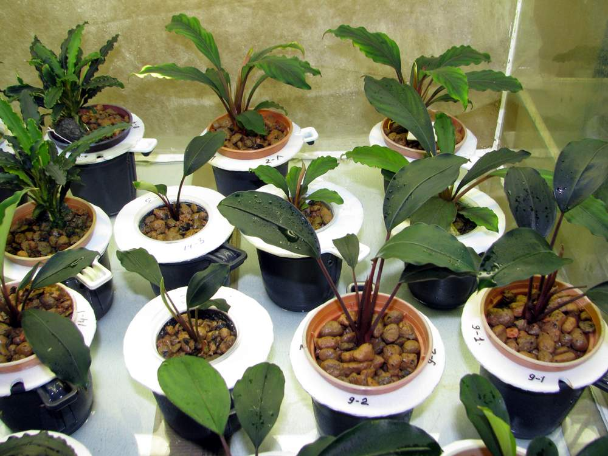

## Новые растения, новые болезни

### Полученные растения здоровьем не блещут

### В основном это различные гнили и обрастания

### Каждую партию приобретённых растений  разместил в отдельной тепличке, а каждое растение высадил в отдельные изолированные емкости с питательным раствором

### По мере роста пересадил растения в более крупные емкости

### На кустах появились отростки

### После тщательной дезинфекции отростки высадил в специальный изолятор

### Изолятор для содержания отростков

55 х 55 х 27 (Н) см  сверху закрыт стеклом и укрывным материалом (для защиты от насекомых). 

Растения высажены в двойные горшки с питательным раствором, на дне теплички – раствор ядохимикатов

### Следил за тем, чтобы растения не прикасались друг к другу  листьями

### Надеюсь, что из этих отростков получатся хорошие маточники, да и продавать такие отростки не стыдно

### Тщательная изоляция каждого растения позволила избежать создания рассадника заразы

