## Bucephalandra sp. Simunjam

### 20.07.11
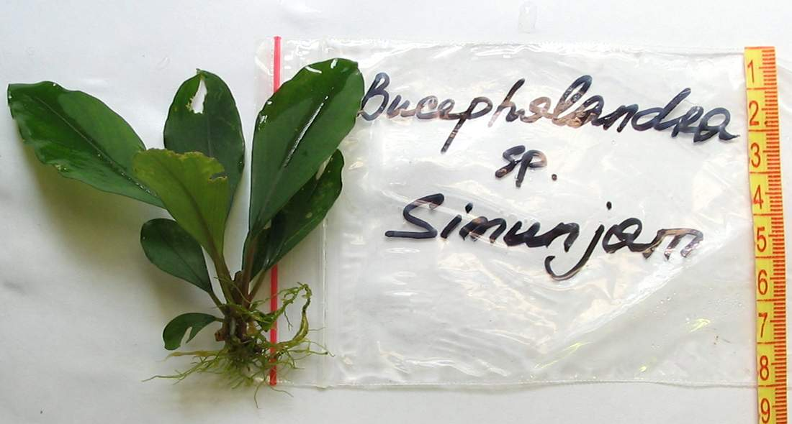

Куст с отгнившей точкой роста

### 09.08.11
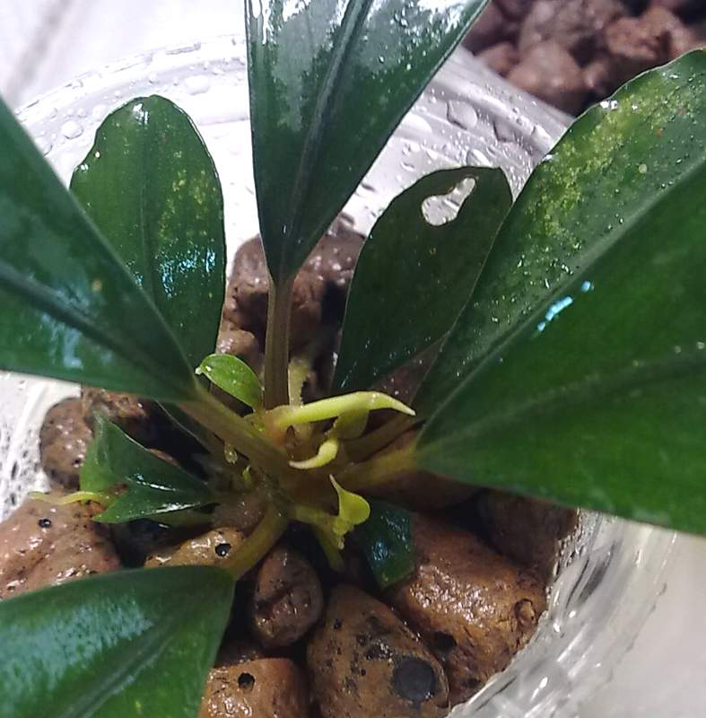

### 15.08.11
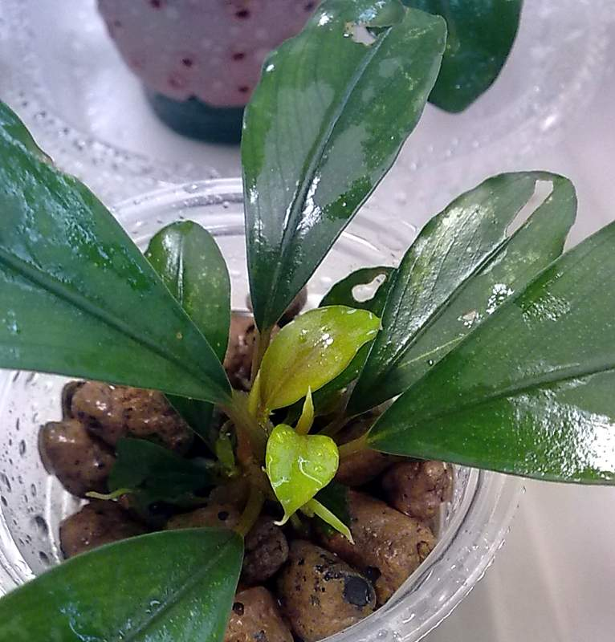

### 03.11.11
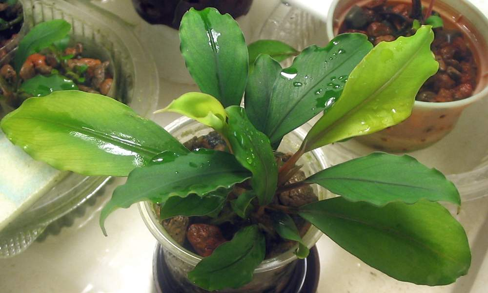

### 06.12.11
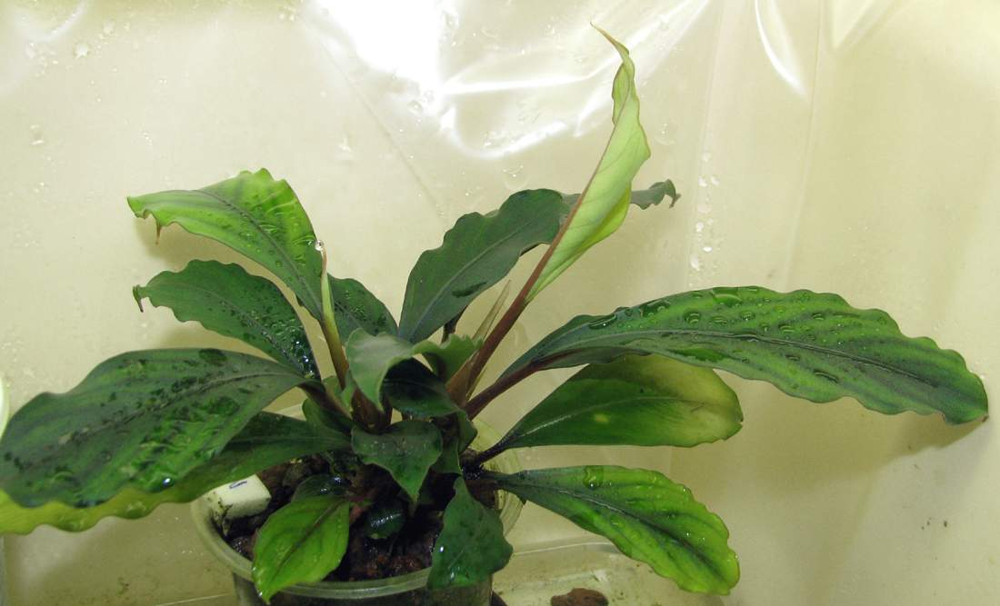

### 21.01.12
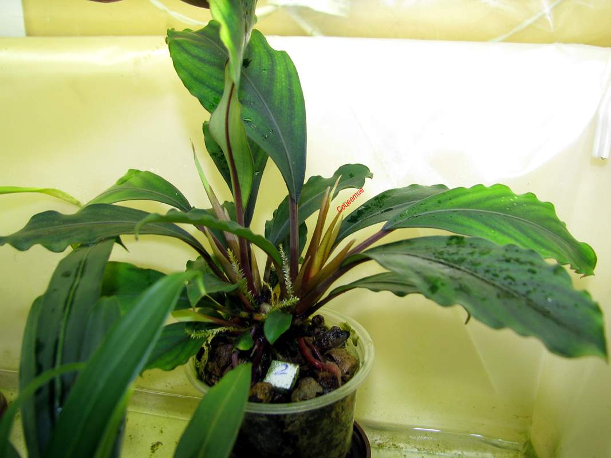

### 06.02.12
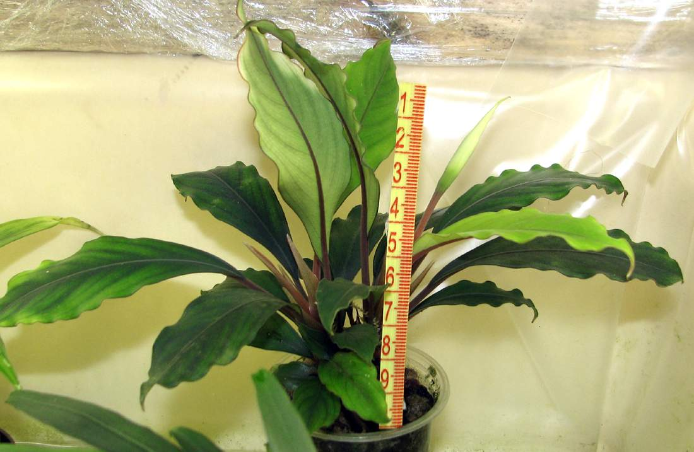

### 21.02.12
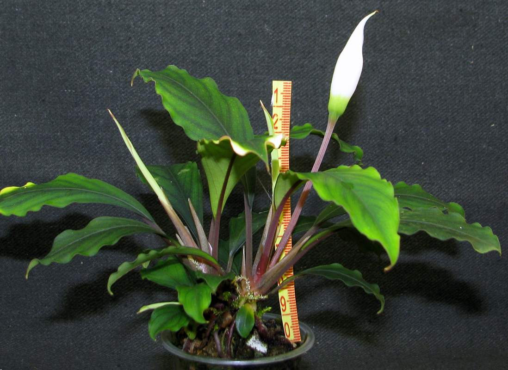

Куст - два побега.

### 22.02.12
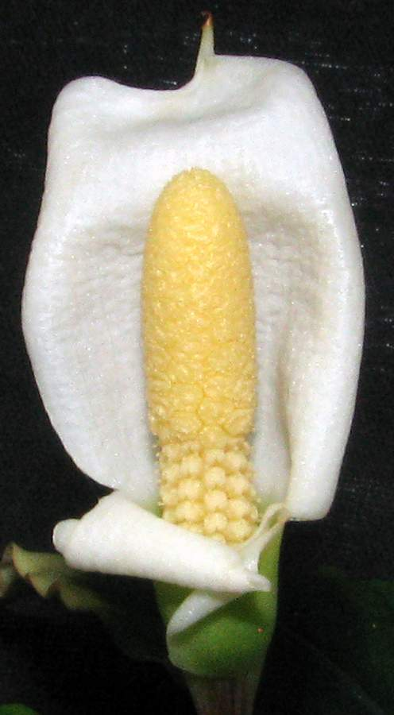

### 20.05.12
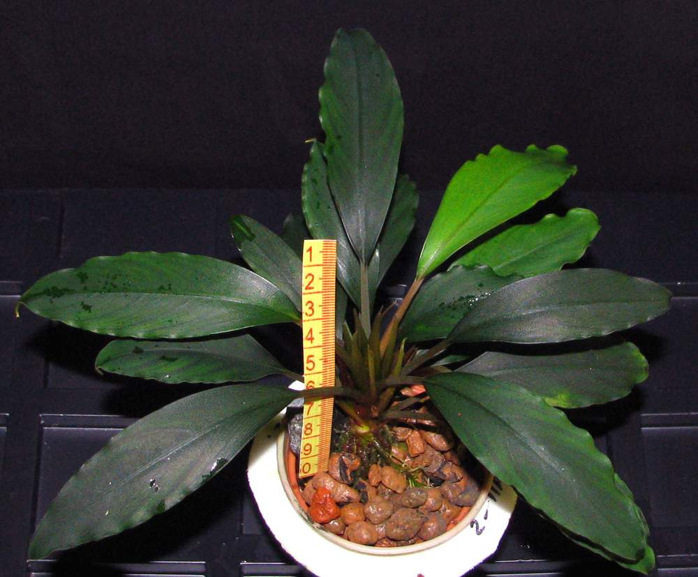

Отделил правый побег. 

### За год отделил 9 отростков
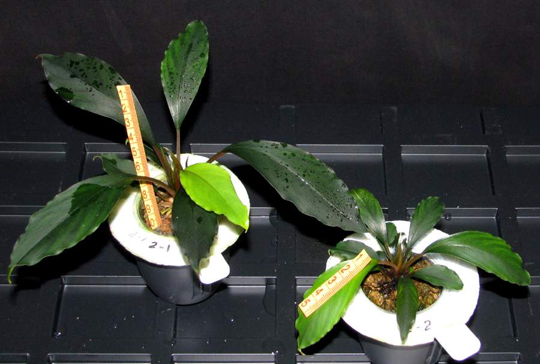

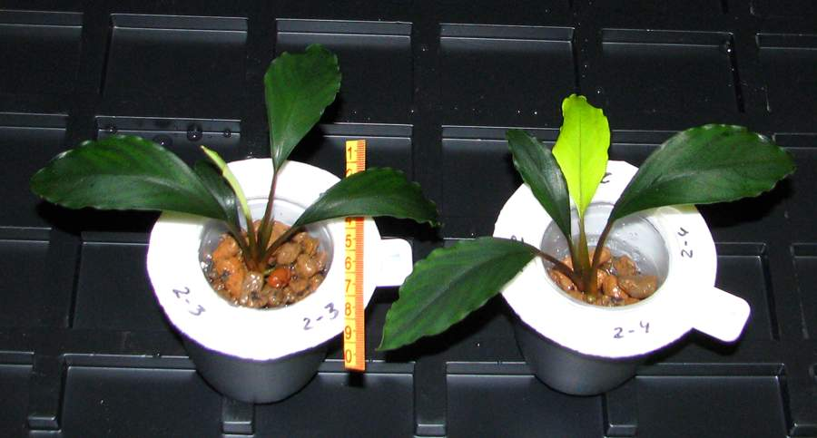

### 20.07.12
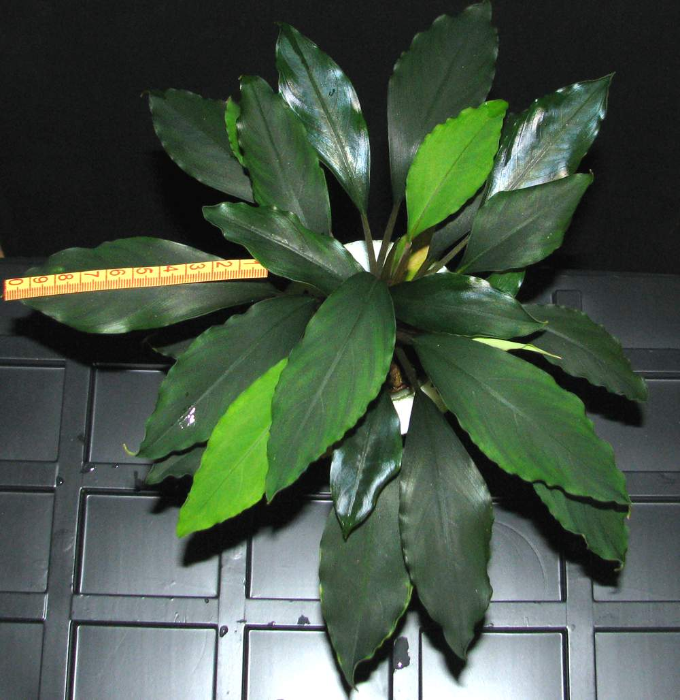

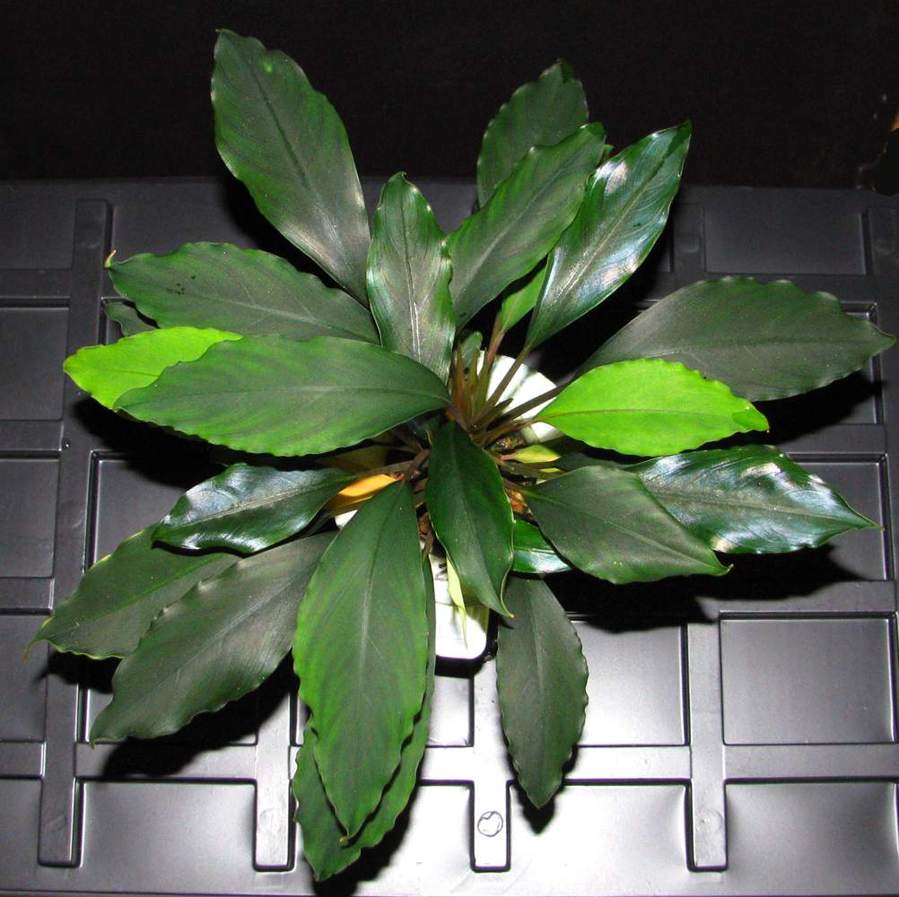
