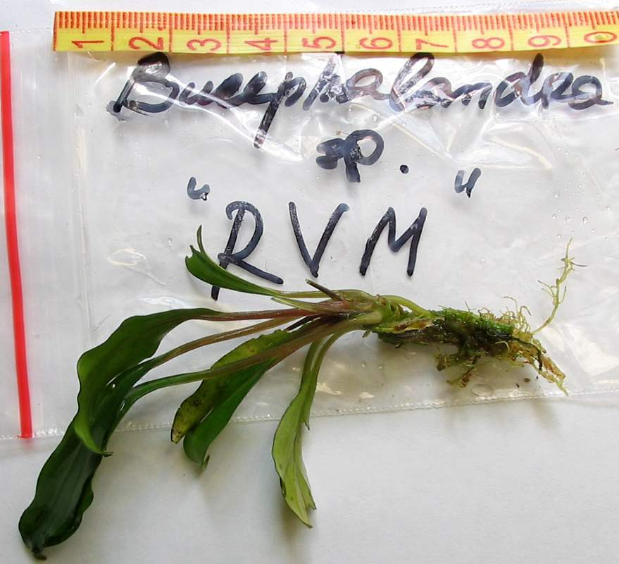
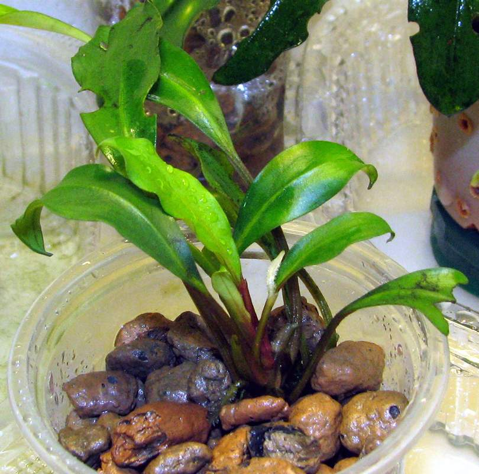
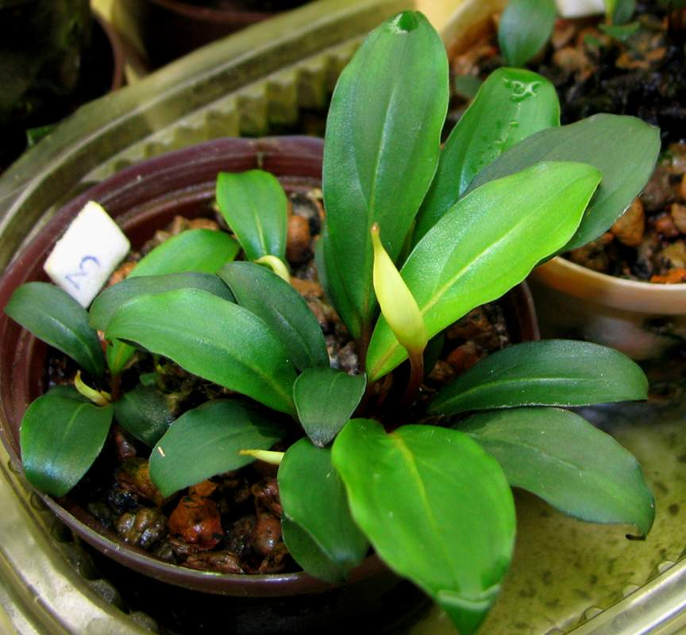
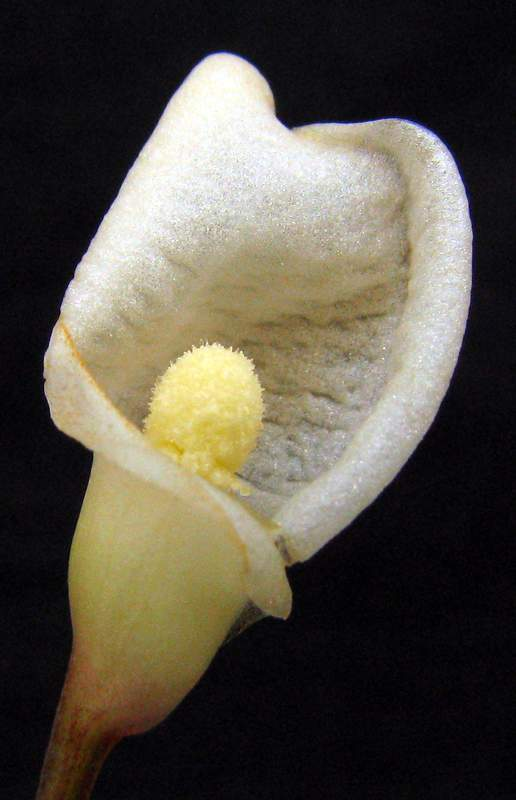
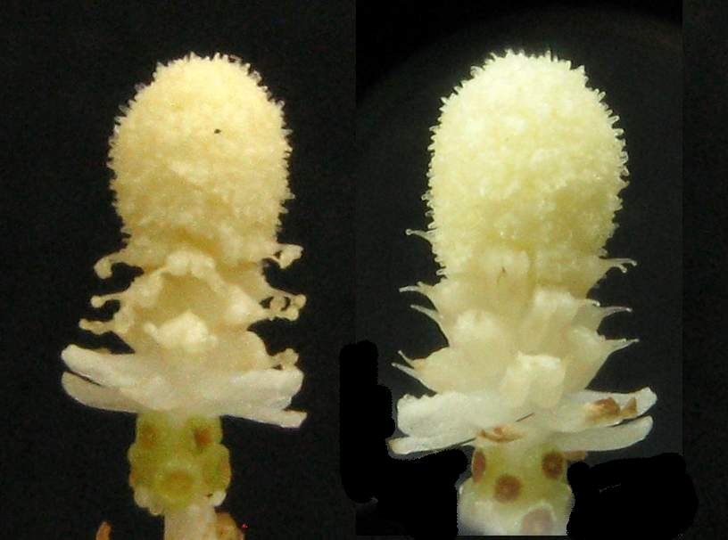
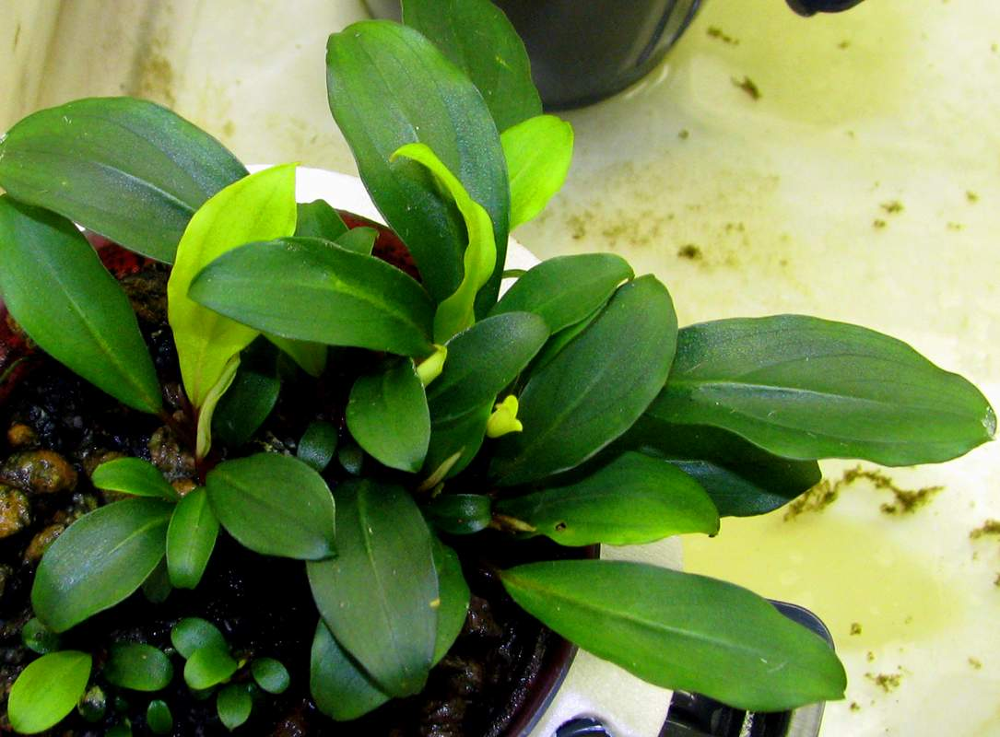
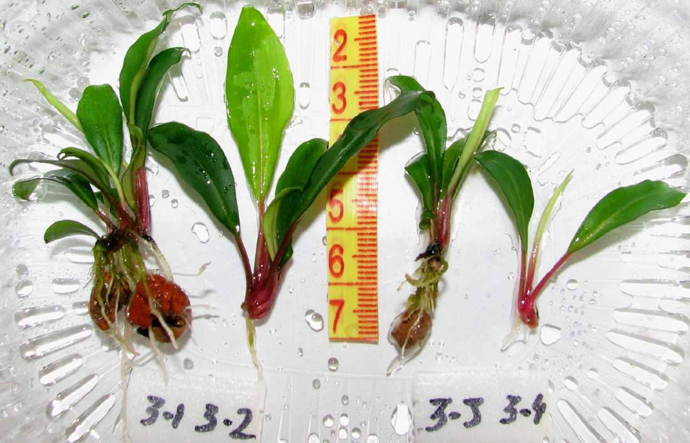
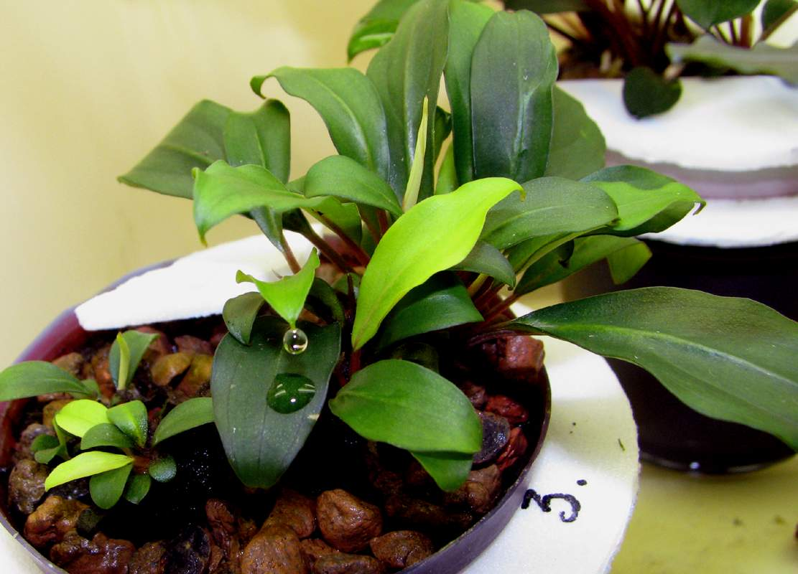
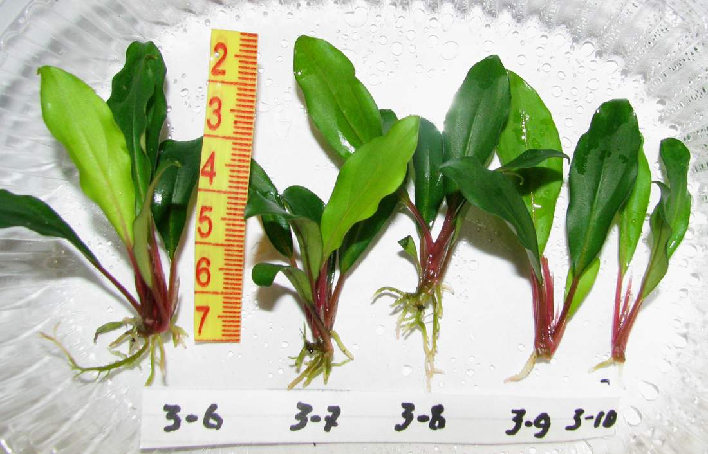
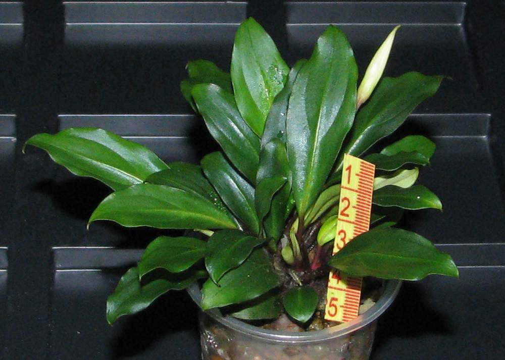

## Bucephalandra sp. "Red Vein" South Malinau, East Kalimantan (RVM)

### 20.07.11

### 21.08.11

### 16.01.12

### 10.02.12

### 11.02.12

### 16.03.12

### 30.03.12

### 13.04.12

### 09.06.12

### 20.07.12

