## Bucephalandra sp. Green Saw, West Kalimantan (GS)

### 13.09.11
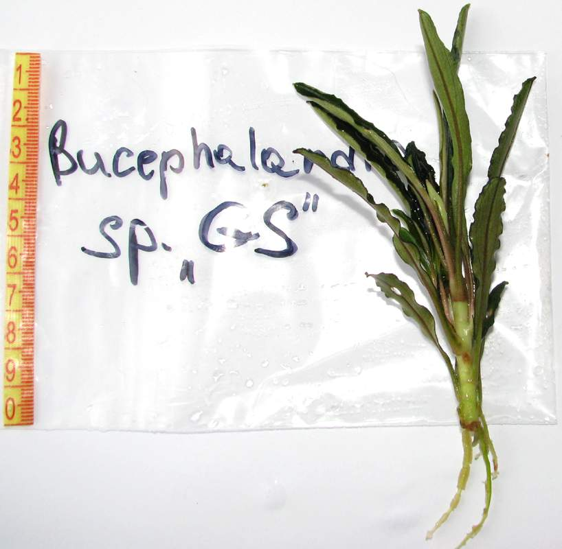

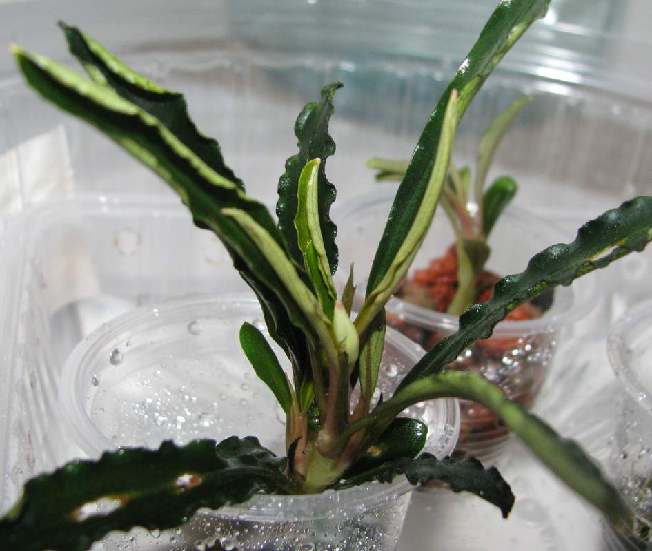

### 20.10.11
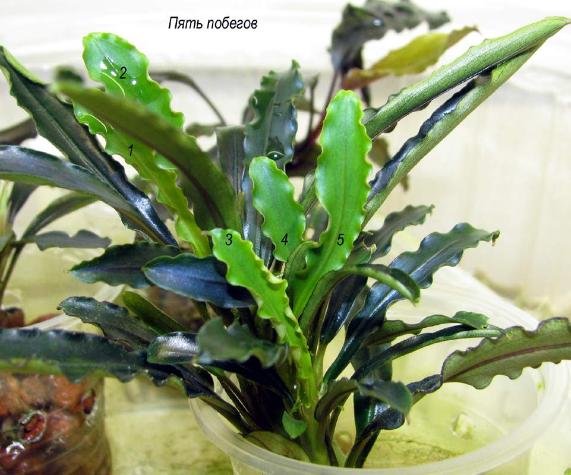

### 11.12.11
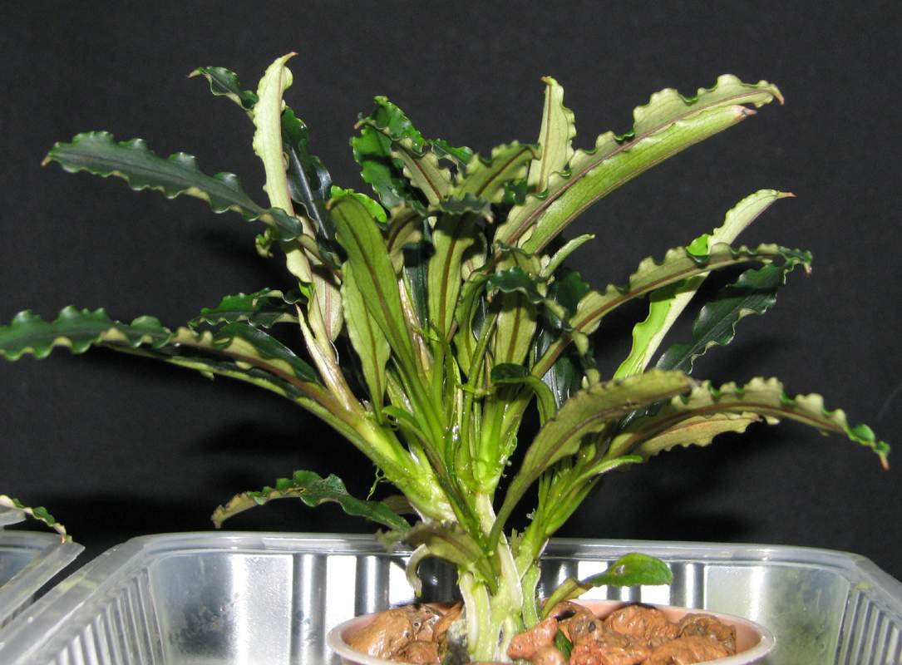

### 28.02.12
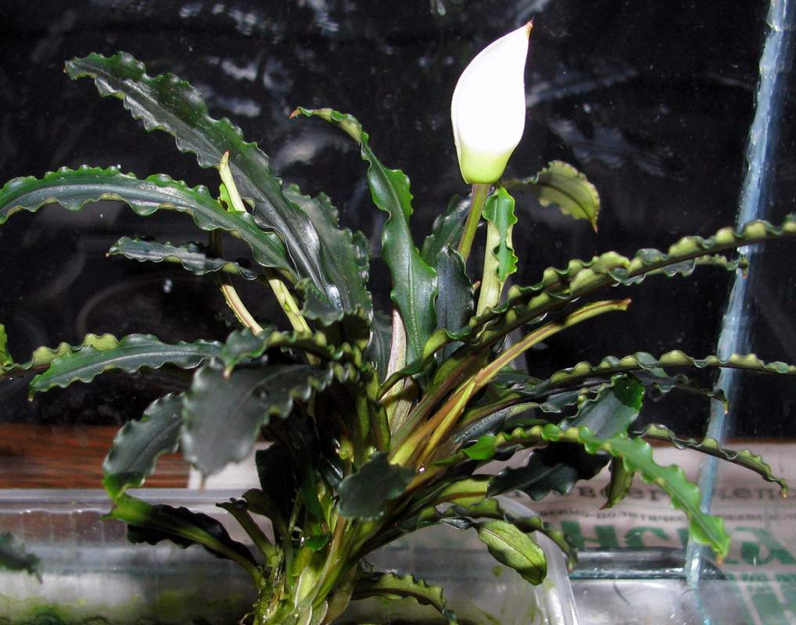

### 28 и 29.02.12
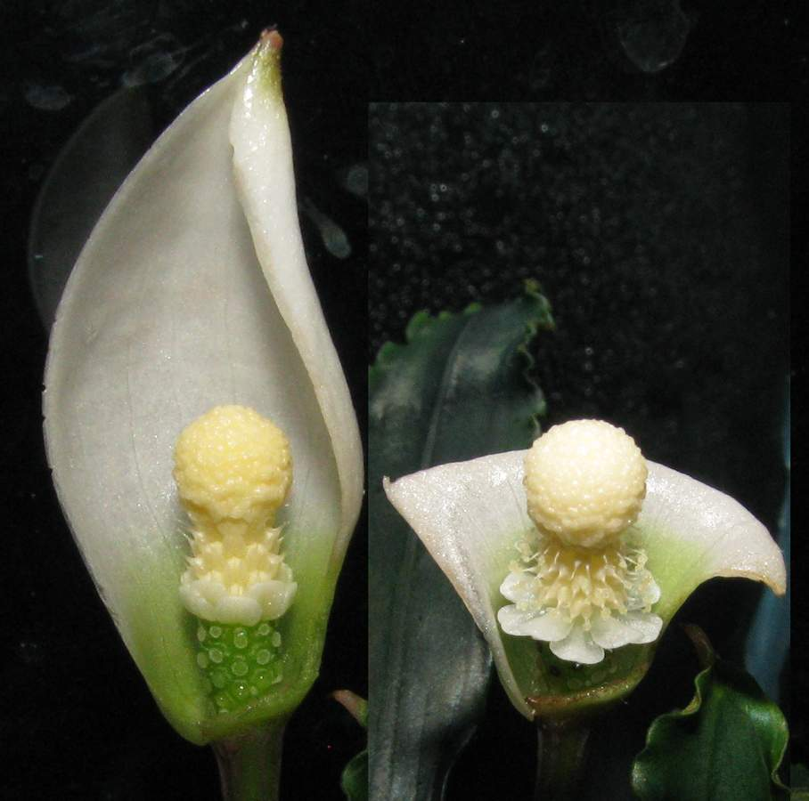

### 21.04.12
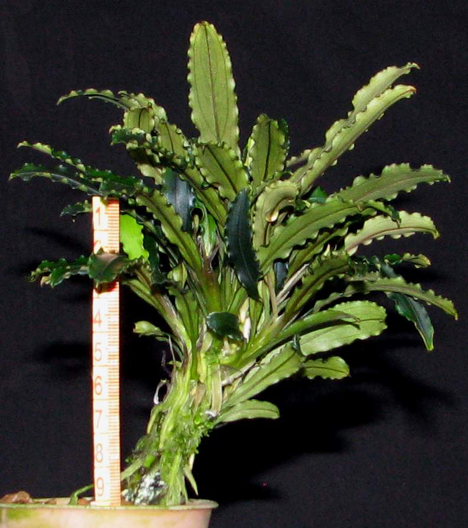

### 21.04.12
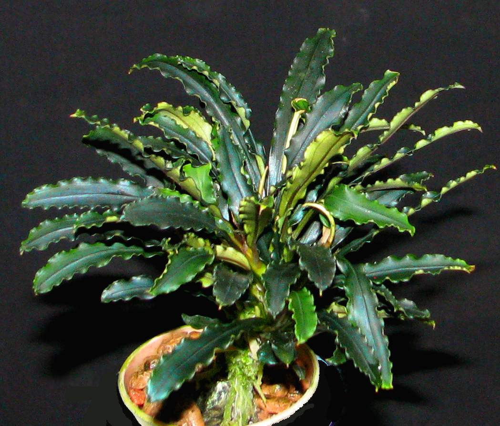

### 24.06.12
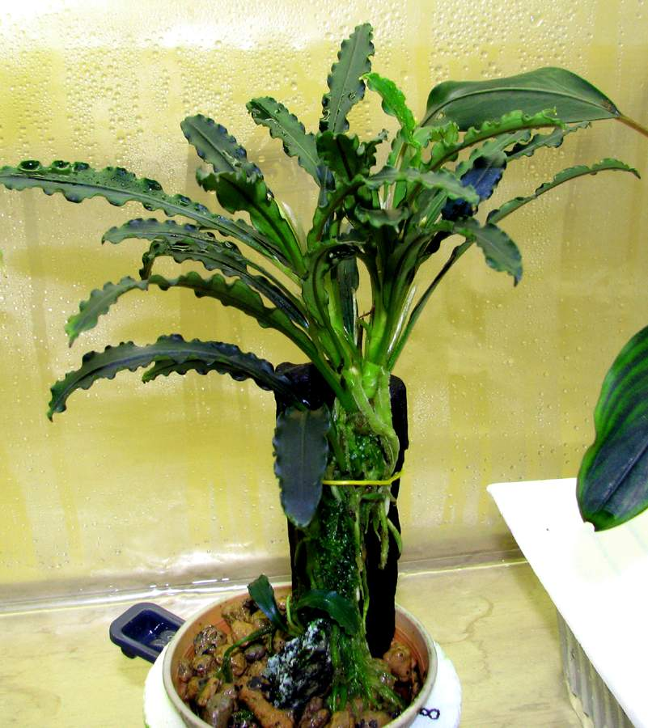

Общипал куст, оставил два побега. 

### 13.09.12
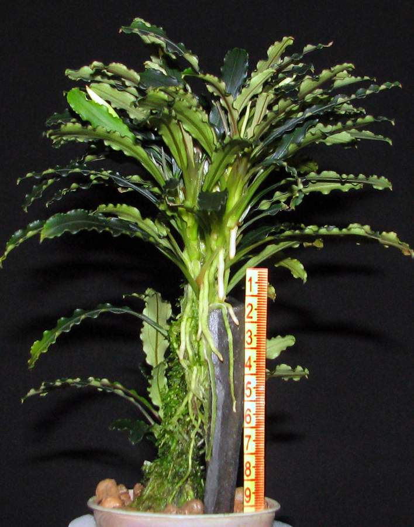

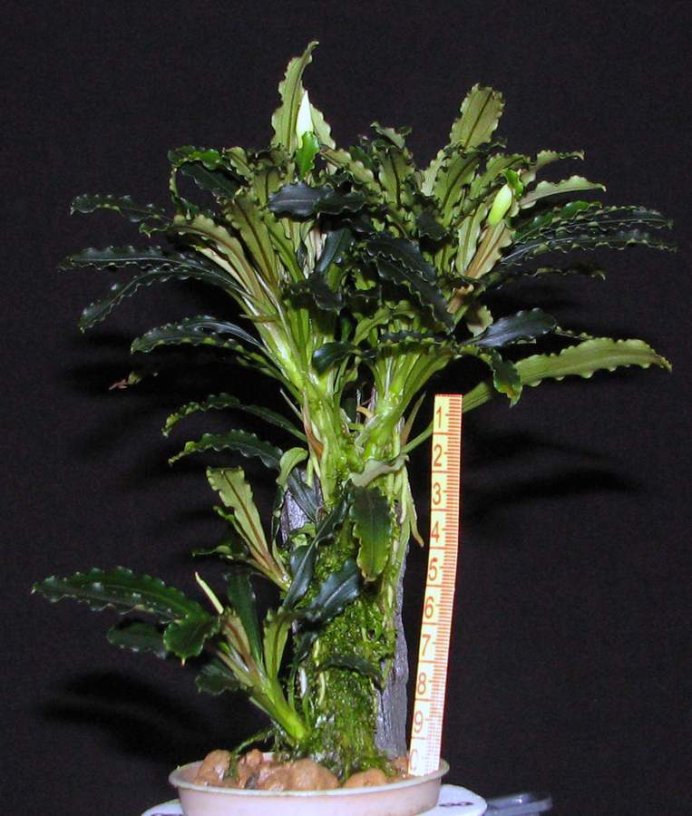

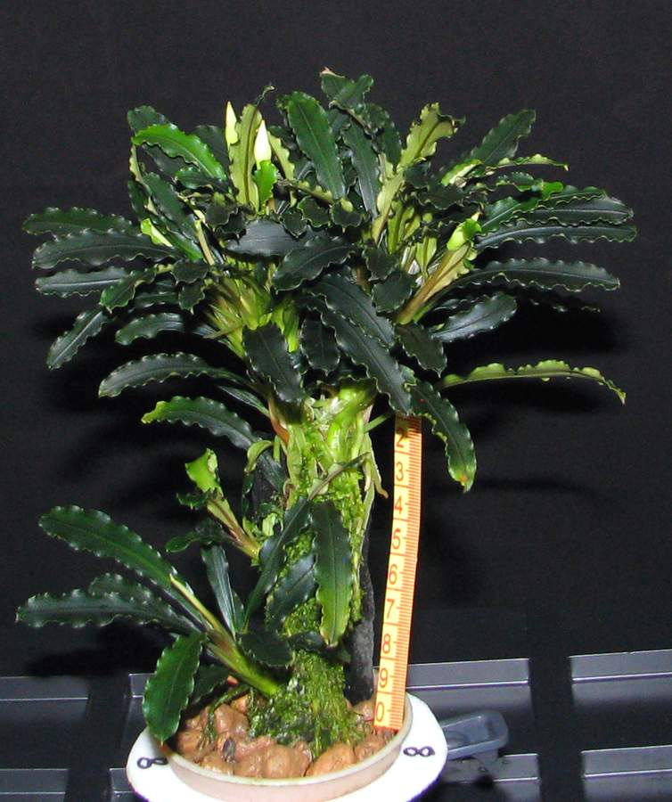

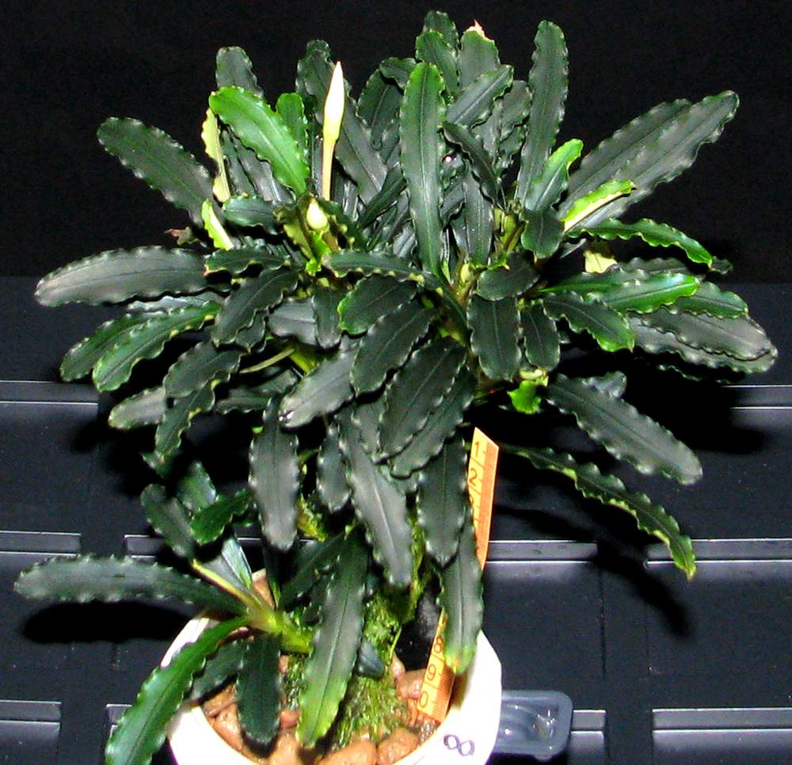

За год отделил 32 отростка. 

